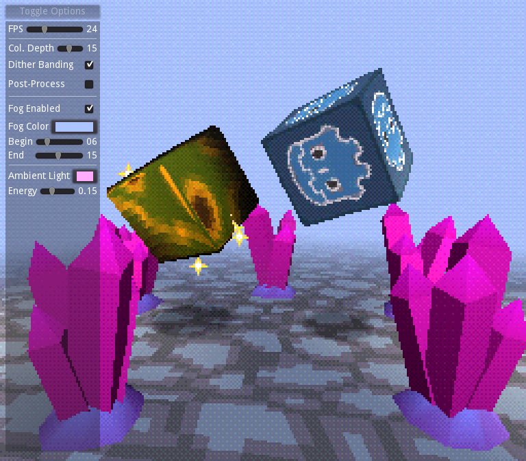

# Godot PSX Style Demo

[Play demo in browser!](https://menacingmecha.itch.io/godot-psx-style-demo)

A collection of shaders and materials for Godot engine that aim to recreate the following aspects of the PS1 aesthetic:

- Vertex "snapping"
- "Wobbly" texures through affine texture mapping
- Limited color depth
- Hardware dithering to hide color banding
- Shiny chrome-like metallic surfaces
- Billboard sprites
- Fog to limit draw distance

## Demo Controls

- Space: Toggle camera and object movement
- R: Reset scene

## Tips for best results

- Use very low poly models
    - Prefer smooth-shading over flat-shading wherever possible
    - Don't be afraid to include extra edge loops to smooth out texture distortion in your geometry! PS1 levels often had much higher polycounts than you might expect!
- Keep textures as low resolution as you can
    - Make sure filtering and mip-maps are both disabled
    - Rely on a mix of vertex colours and texture maps, instead of higher detailed texture maps wherever possible
    - Posterizing your textures with a depth of 15 or 16 before import goes a long way to making them feel more "PS1"
- Keep your internal resolution low
    - Common PS1 resolutions were 256×240, 320x240 and 512x240 ([Source](https://docs.google.com/spreadsheets/d/1UgysgrgqbiIlyHIiwCxVoWMu1bwgO2OBlDO1ORpsi78/edit?usp=sharing))
    - That being said, you can easily go widescreen by using a 16:9 resolution with similar height
- Use as basic of a lighting set up as you can get away with
    - Modern lighting techniques are a very easy way to break the illusion of appearing like early 3D!
    - Where possible, prefer to use white ambient light, with vertex colours on geometry to fake lighting
- Prefer additive blending to transparent blending

Originally based on: https://github.com/marmitoTH/godot-psx-shaders

Floor texture (available under CC-0): https://stealthix.itch.io/rpg-nature-tileset

## Games using these shaders (in some form)
- [Isle of Dreamers](https://menacingmecha.itch.io/isle-of-dreamers) - [MenacingMecha](https://menacingmecha.github.io/)
- [Inktober 2020 Demo Disc](https://menacingmecha.itch.io/inktober-2020-demo-disc) - [MenacingMecha](https://menacingmecha.github.io/)
- [Please Don't Feed the Creatures of the Deep](https://vaporshark.itch.io/please-dont-feed-the-creatures-of-the-deep) - [VaporShark](https://vaporshark.itch.io/)
- [Headlines from the Deep](https://menacingmecha.itch.io/headlines-from-the-deep) - [MenacingMecha](https://menacingmecha.github.io/)
- [Beetlebum](https://menacingmecha.itch.io/beetlebum) - [MenacingMecha](https://menacingmecha.github.io/)
- [P.O.S.S.U.M.](https://vaporshark.itch.io/possum) - [VaporShark](https://vaporshark.itch.io/)

Please submit a PR (or send a message) if you have a title to add!
